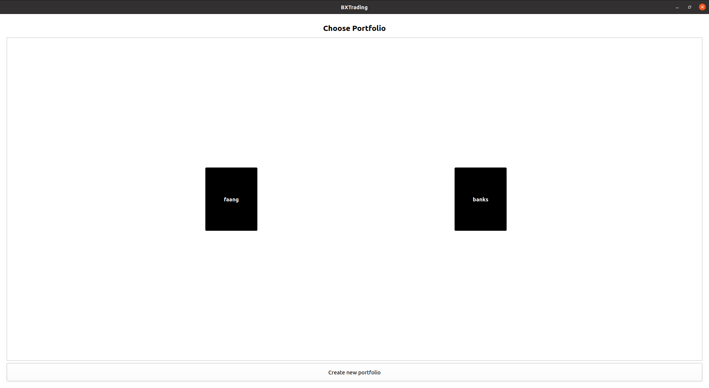
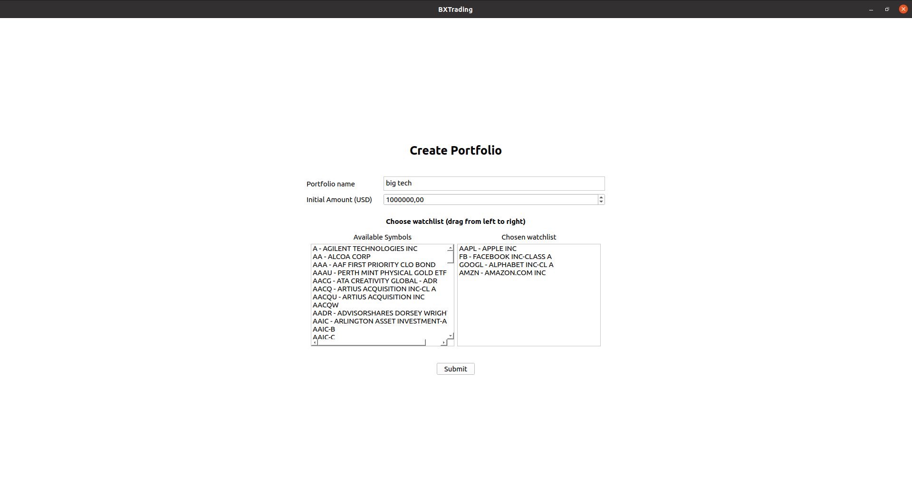
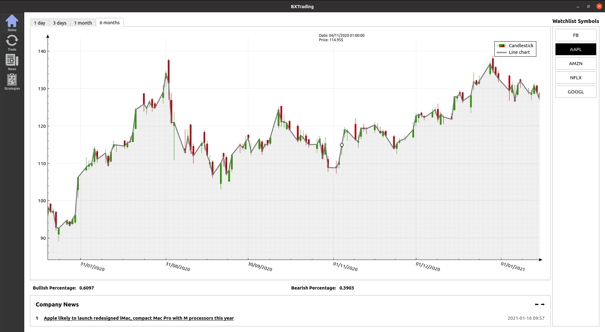
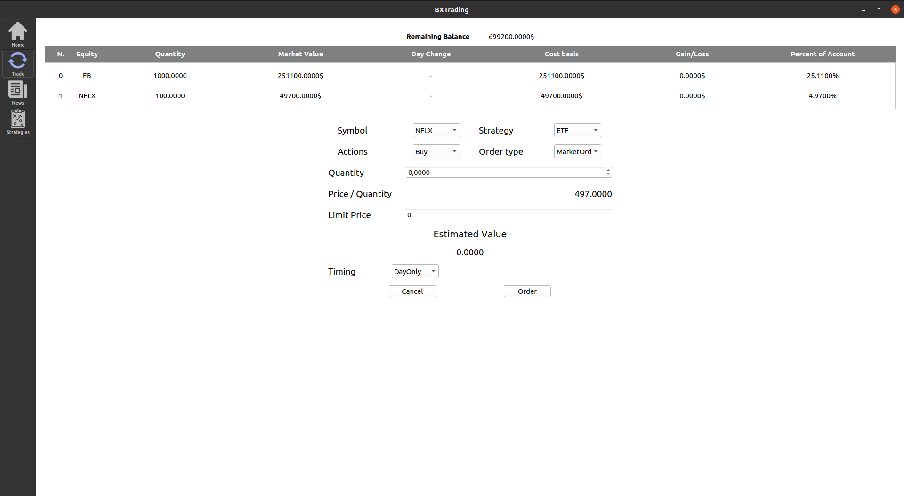
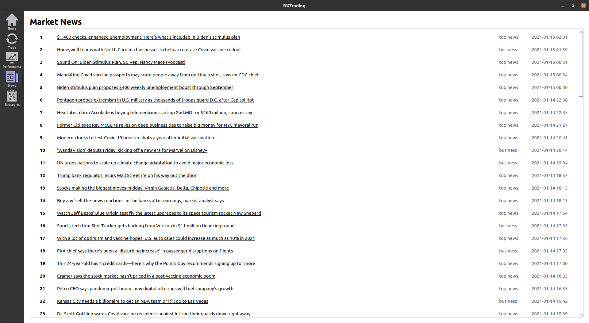
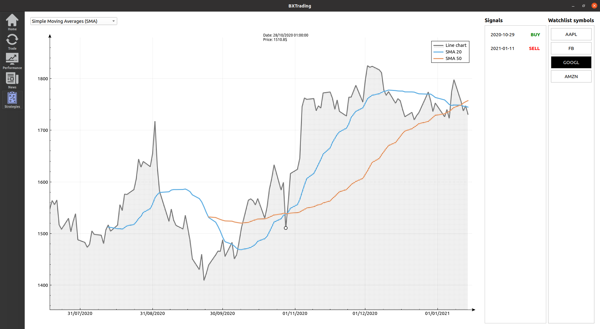

# TradingPlatform++
TradingPlatform++, as the name suggests, is a fully featured stock trading platform built in C++.

## Features we provide:
1. Give the user the ability to create many portfolios where each portfolio has some stocks to trade and its own performance assessment.
2. Display the line chart and candle chart of any stock that [Finnhub](https://finnhub.io/) provides along with a vertical tracer to show the closing price.
3. Display each company's specific news under its graph.
4. Allow the user to buy and sell stocks with different order types and display his performance accordingly.
5. Show the Market news in a specific tab for more detailed info about the markets.
6. Display the plot of some strategies that we researched in the Strategy tab to allow the user to understand them.
7. Show the signals of whether we should buy or sell according to these strategies and the sentiment analysis of the news.

## Team Members:
1. Mehdi Makni (Project Leader)
2. Mira Hajar
3. Ayari Rayen
4. Guruprerana Shabadi (GUI Team Leader and Git Master)
5. Maxime Lamy
6. Maayane Attias
7. Mamoune Mouchtaki
8. Alban Puech (Trello Leader)
9. Khanh Nguyen
10. Vishrut Malik
11. Frederic Marcel Tchouli
12. Vinh Nguyen (Research Team Leader)

We have been organized mainly into these subgroups:

### API Team

1. Mehdi Makni
2. Rayen Ayari

### GUI Team

1. Guruprerana Shabadi 
2. Khanh Nguyen
3. Maxime Lamy
4. Mamoune Mouchtaki
5. Vinh Nguyen 
6. Rayen Ayari


### Research Team

1. Vinh Nguyen 
2. Frederic Marcel Tchouli
3. Vishrut Malik
4. Alban Puech
5. Mira Hajar
6. Maayane Attias

# Instructions for Ubuntu and macOS:

## Installing cURL

In order to call the API [Finnhub](https://finnhub.io/)  , we use [libcurl](https://curl.se/libcurl/).

Run the following commands on the terminal:

### Ubuntu
```
sudo apt install curl
sudo apt install libcurl4-openssl-dev
```

### macOS
```
brew install curl
```

## Building guide

### Highly recommended

Donwload [Qt Creator](https://www.qt.io/product/development-tools) then open the project in Qt Creator to run it.
- Open Qt Creator
- Click on `File`
- Click on `Open File or Project...`
- Follow the path where you cloned the repository
- Go to `src` folder
- Click on `trading-platform-pp.pro`
- Click on Open
- Run  `Ctrl+R`

<br>

Otherwise you can follow these steps for Ubuntu users.


Run the following commands on the terminal:
```
sudo apt-get install qt5-default
```

Now you need to run this script that you can find in `scripts\build.sh`:

```
rm -rf build
mkdir build
cd build
qmake ../src/trading-platform-pp.pro
make -j8
./trading-platform-pp
```

# Screenshots of the Project:

Here we will show some screenshots of the projects and instructions to use it.

## Choose Portfolio

The Project starts by showing all previous portfolios that you have created and allows you to create a new one.



## Create Portfolio

In case you are going to create a new portfolio, we show the following page:



- Type a name for your new portfolio.

- Choose an initial amount of money in USD. 

- Select the stocks you want to trade using symbols (You can start typing "AAP" to find AAPL for example).

- Submit.

## Home Tab



- On the right, there is a list of symbols in this Portfolio.

- We display the graph of the price of each stock. You can select 1 day - 3 days - 1 month - 6 months periods. You can also select another stock from Watchlist Symbols on the right to switch to their price graph.

- There is a zoom-in zoom-out and shifting features for the graph for a better user experience.

- Under the graph, there is the Bullish Percentage (Percentage of people who believe that stock will go up) and Bearish Percentage (Percentage of people who believe that stock will go down).

- Under the sentiment analysis, there is a column showing the company news and which you can change by clicking on the arrows to the upper-left of the column.

## Trade Tab



- Buy or sell stocks from your watchlist as long as you do not end up with a negative remaining balance.

- We will implement other order types in the future but now we only support market order with ETF strategy, no limit price and day only timing.

## News Tab



- For more information about the market and the most updated news of all major disciplines that can affect the market, the user can consult Market News Tab where there is a list of news links from various sources like CNBC.

## Strategy Tab



This is where the user can look at the different graphs of strategies we have used as well as the signals that they give so that they understand better how they work and how he/she can use them for trading.

The Strategies we have so far are:

- Simple Moving Averages

- Exponential Moving Averages

- Momentum

- Linear Regression

# External Libraries we use

- For testing our strategies and measuring their performance we have used a [backtesting environment](https://github.com/evankirkiles/backtest-environment) implemented in C++ and that was pushed into master.

- For Graphing we have used [qcustomplot](https://www.qcustomplot.com/) that was pushed into master.
